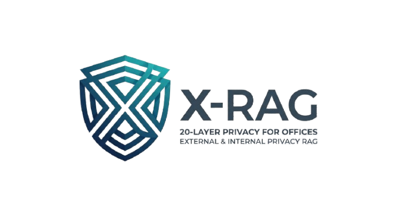

<p align="center">
  
</p>

# X-RAG

Provider-pluggable enterprise RAG: upload documents, ask questions, get answers with citations `[doc#chunk]`, department ACL on every retrieval path.

**Stack:** FastAPI · pgvector (Supabase) or Qdrant · Jina/BGE embeddings · Groq/Ollama LLM · JWT groups (`hr` / `eng` / `public`).

---

## Status — live on Choreo

Deployed: <https://d3739c77-849e-44a6-bdef-e35881d9a1a6.e1-us-east-azure.choreoapps.dev> (demo users `LUFFY` / `ZORO`, password `password`)

- **Cited answers** — every claim traceable to `[doc#chunk]`; click a chip, the source flashes
- **Department ACL enforced before search** — HR docs never enter ENG retrieval, counts and caches included
- **Quick / Deep modes** — role-defaulted, per-question override
- **Provider-pluggable** — swap LLM, embeddings, reranker, vector store, or DB in one `.env`
- **Single-port Docker** — FastAPI serves API + UI; non-root image, `53/53` tests passing in-container
- **Deliberately lean** — no eval harness, no tracing stack, no moderation models ([why](docs/explanation.md#about-whats-deliberately-left-out)); verification pills, cache, and audit trail cover it

---

## Quickstart

```bash
python3 -m venv .venv
.venv/bin/pip install --index-url https://download.pytorch.org/whl/cpu torch
.venv/bin/pip install -r requirements.txt
cp .env.example .env   # fill keys / DB_URL as needed

.venv/bin/python -m backend.run seed
.venv/bin/python -m backend.run          # http://localhost:8001
```

Swagger: [http://localhost:8001/docs](http://localhost:8001/docs)  
Health: `GET /health` → `{"status":"ok", ...}`

### Seed users

| Username | Password   | Groups     |
|----------|------------|------------|
| `LUFFY`  | `password` | hr, public |
| `ZORO`   | `password` | eng, public |

---

## Typical flow (API)

1. **Login** — `POST /auth/login` → `access_token`
2. **Ingest** — `POST /ingest?allowed_groups=hr&enrich=true` with multipart file field `f`
3. **Query** — `POST /query` body `{"query": "...", "top_k": 5, "mode": "quick"}`  
   - `mode`: `"quick"` | `"deep"` | omit for role default (`hr`→quick, `eng`→deep)

ACL is pre-search: a user’s `groups` must intersect the document’s `allowed_groups` or chunks are never retrieved.

---

## Tests

```bash
.venv/bin/python -m pytest tests/ -q   # 53 passed
node frontend/e2e.mjs                   # 28/28 in headless Chrome (needs backend + frontend + CDP :9222)
```

Covers ACL, pgvector cast, BM25 group filtering, auth, modes, cache, API surface.

---

## Docs map

| Kind | Where |
|------|--------|
| Tutorial / how-to / reference / explanation | [docs/](docs/README.md) |
| Product / layers / deploy matrix | [SPEC.md](SPEC.md) |
| Interactive API | `/docs` on a running server |
| Config template | [.env.example](.env.example) |
| Docker | [Dockerfile](Dockerfile) — usage in [docs/how-to.md](docs/how-to.md) |
| This project entry point | this README |

---

## Logos

| File | Use |
|------|-----|
| `doc_data/long_logo.png` | Wide wordmark (README header) |
| `doc_data/short_logo.png` | Shield mark (compact / avatar) |
